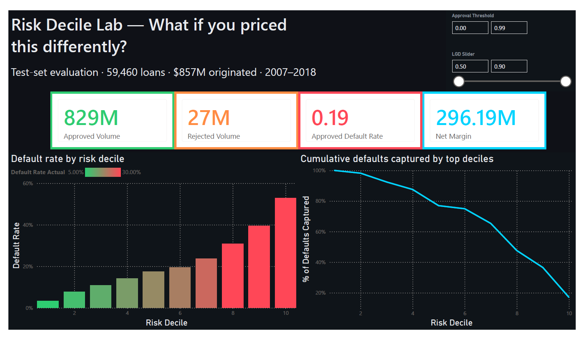
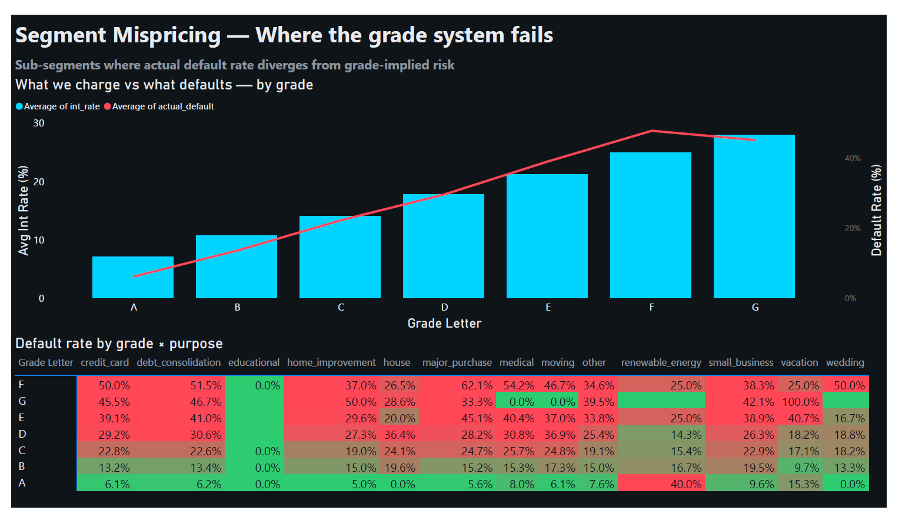
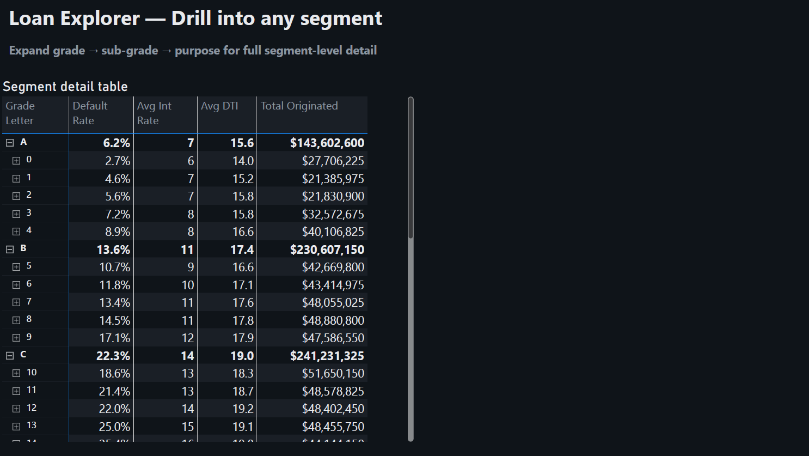
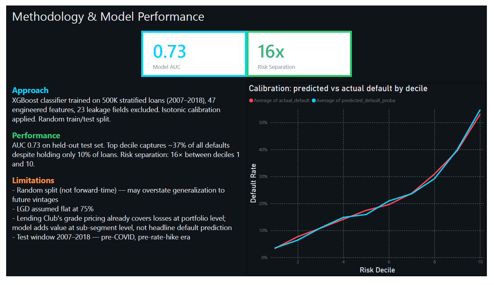

# Credit Risk Analytics Dashboard


## Overview

The **Credit Risk Analytics Dashboard** is a Power BI report designed to analyze LendingClub loan risk, borrower behavior, default patterns, and portfolio performance.

The dashboard helps users understand how loan characteristics such as grade, purpose, interest rate, debt-to-income ratio, and predicted default probability impact credit risk. It provides an interactive view of portfolio health, risk segmentation, loan-level details, and model-driven insights.

This project focuses on **Power BI dashboard customization, visual storytelling, KPI reporting, and credit risk analysis**.

---

## Dashboard Pages

### 1. Portfolio Health


This page provides a high-level overview of the loan portfolio. It summarizes key metrics such as total loans, loan amount, default rate, average interest rate, and predicted default probability. It helps quickly understand the overall health and risk exposure of the portfolio.

---

### 2. Risk Decile Analysis



This page analyzes loans by risk decile. It shows how predicted default probability and actual default behavior change across different risk groups. This helps identify whether higher-risk segments are correctly separated from lower-risk loans.

---

### 3. Segment Mispricing



This page compares loan risk across borrower segments such as grade, purpose, and interest rate. It helps identify segments where pricing may not fully reflect default risk, allowing users to spot potential mispricing or high-risk borrower groups.

---

### 4. Loan Explorer



This page provides a detailed loan-level view. Users can filter and explore individual loan records based on grade, purpose, risk decile, default status, interest rate, loan amount, and predicted default probability.

---

### 5. Methodology



This page explains the data source, model output, assumptions, and dashboard interpretation. It provides context for how predicted default probability, actual default status, and risk deciles are used in the report.

---

## Key Features

- Interactive Power BI dashboard
- Credit risk KPI tracking
- Default rate analysis
- Risk decile segmentation
- Grade and purpose-level risk comparison
- Loan-level drill-down view
- Clean report layout with customized colors and page names
- Business-focused dashboard storytelling

---

## Tools Used

- Power BI Desktop
- Power Query
- DAX
- CSV data source
- Credit risk analytics concepts

---

## Folder Structure

```text
Credit-Risk-Analytics-main/
│
├── dashboard_snaps/
│   ├── portfolio_health.png
│   ├── risk_decile_analysis.png
│   ├── segment_mispricing.png
│   ├── loan_explorer.png
│   └── methodology_and_model_performance.png
│
├── outputs/
│   └── loan_predictions.csv
│
├── Credit Risk Analytics Dashboard.pbix
├── Credit Risk Analytics Dashboard.pdf
└── README.md
```
